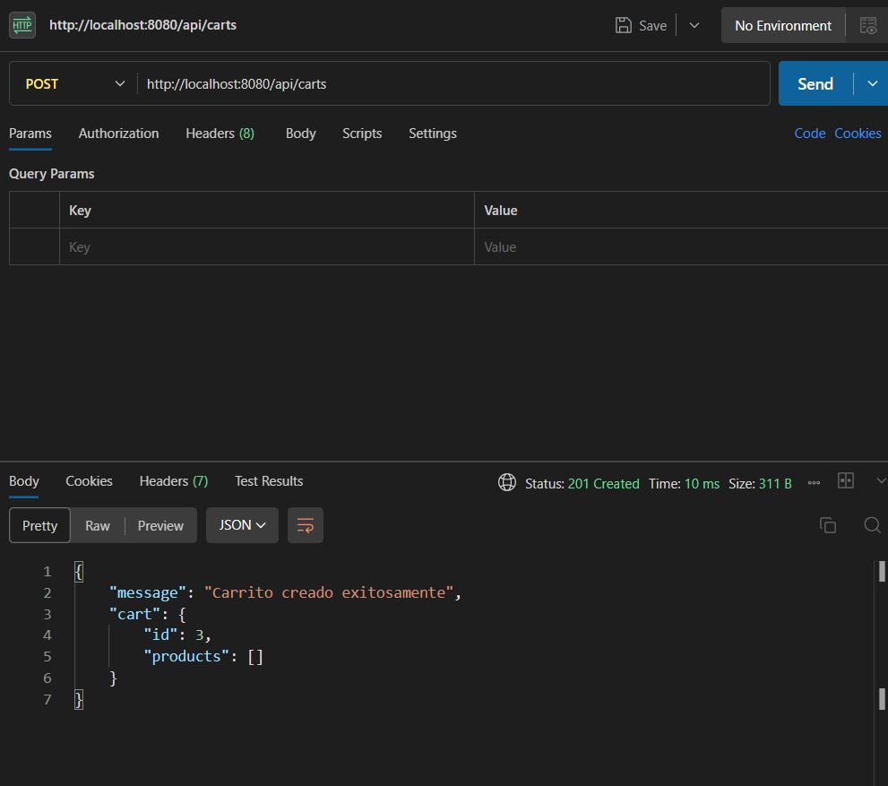

# Entrega N°1 - API de Productos y Carritos

## Descripción
Servidor en **Node.js** con **Express** que gestiona productos y carritos de compra.  
Persistencia mediante archivos JSON (`products.json` y `carts.json`).  

---

## Endpoints

### Productos (`/api/products`)
- **GET /** Lista todos los productos.  
- **POST /** Agrega un producto con los campos:
  - `title` (string)
  - `description` (string)
  - `code` (string)
  - `price` (number)
  - `stock` (number)
  - `category` (string)
  - `thumbnails` (array de strings)  
  - `id` se genera automáticamente  
  - `status` opcional, default: `true`  

### Carritos (`/api/carts`)
- **POST /** Crea un carrito vacío:
  - `id` autogenerado  
  - `products: []`  

### Home (`/`)
- Muestra título y lista de los endpoints disponibles.

## Implementación
- Clases **ProductManager** y **CartManager** usando **POO**, `async/await`, `try/catch` y `fs.promises`.  
- Servidor Express en `index.js` con todos los endpoints directamente.  
- Ruta `/` como "home" con información y enlaces a los endpoints.

## Pruebas en POSTMAN

GET `/api/products`

POST `/api/products`
Body :  raw JSON
ejemplo: 
 {
  "title": "Short deportivo",
  "description": "Short para entrenar",
  "code": "SH-001",
  "price": 12000,
  "stock": 15,
  "category": "Indumentaria",
  "thumbnails": ["short1.jpg"]
}

- 

POST (`/api/carts`)

